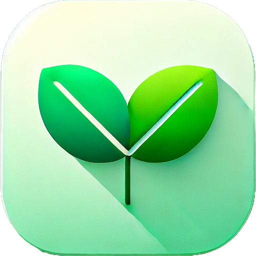
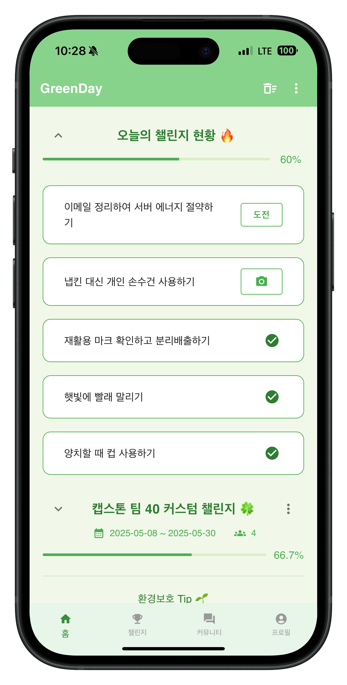
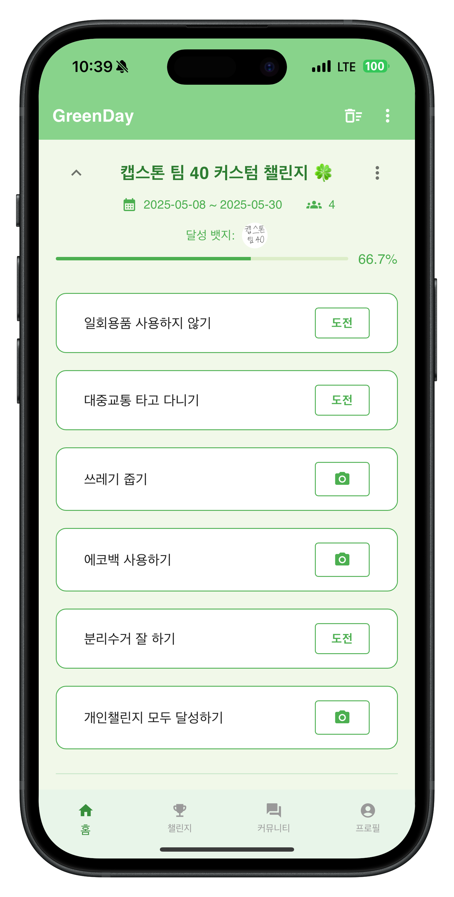
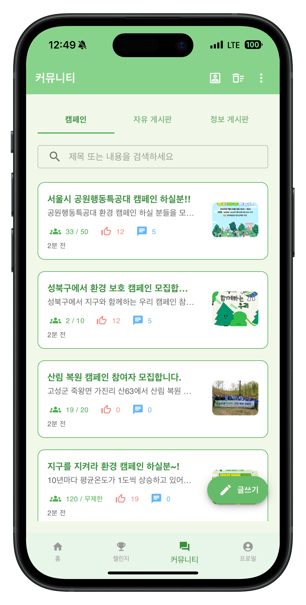
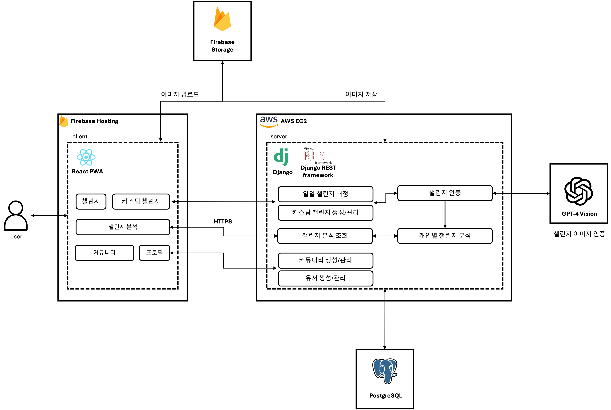
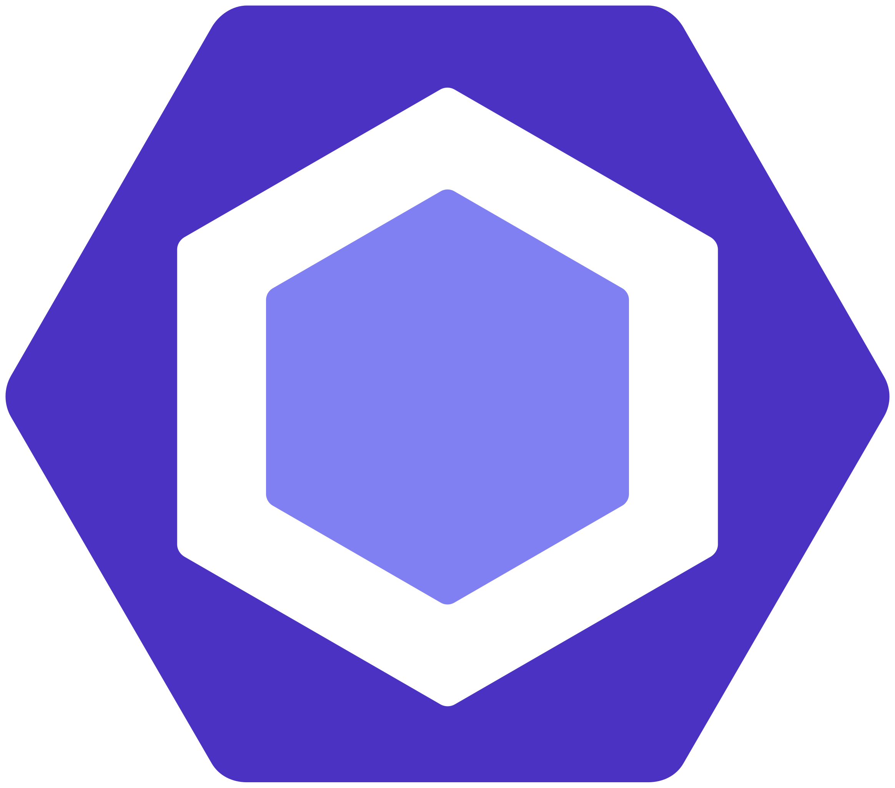
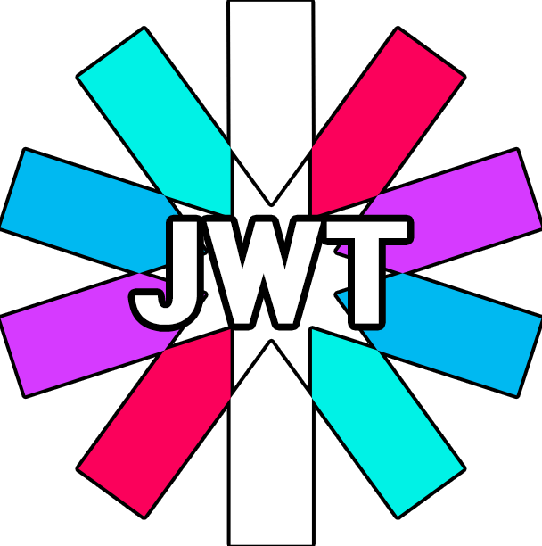

# 🌱 Green Day

## 세상을 파랗게 만드는 작은 습관 만들기

	
	
	
	

GreenDay는 사용자가 일상 속에서 환경 보호를 실천할 수 있도록 도와주는 서비스입니다.

매일 자동으로 제공되는 친환경 미션을 수행하고, 다른 사람들과 함께 직접 챌린지를 만들어 작은 행동을 공유해보세요.

## 📲 서비스 설치하기

	

1. 위의 QR 코드를 기본 카메라 어플로 스캔하여 접속
2. AndroidOS 이용자라면 앱 설치하기 버튼을 누르고,  
   iOS 이용자라면 공유 버튼을 누르고 “홈 화면에 추가”를 선택

## 👥 팀원 소개

|                                                      |                            |                                                         |                                                     |
| :-----------------------------------------------------------------------------------------------: | :---------------------------------------------------------------------: | :--------------------------------------------------------------------------------------------------: | :----------------------------------------------------------------------------------------------: |
| **성창민** 백엔드 Django 기반 REST API, JWT 인증, Celery+Redis 비동기 처리, OpenAI API 연동 | **박상엄** 프론트엔드 화면별 API 연동 및 이슈 관리, 데이터셋 구축 | **정하람** 기획, 인프라 서비스 기획, AWS EC2, EBS, RDS를 활용한 서버 및 데이터베이스 환경 구성 | **채주원** 프론트엔드 React PWA 기반 UI/UX 설계, 퍼블리싱, Firebase 호스팅 및 Storage 설정 |

## 🌐 시스템 구조

  

## 🛠️ 기술 스택

### 🎨 Front-end

<table>
  <thead>
    <tr>
      <th style="background-color:#2e7d32; color:white; padding:10px;">항목</th>
      <th style="background-color:#2e7d32; color:white; padding:10px;">설명</th>
    </tr>
  </thead>
  <tbody>
    <tr><td style="padding:8px;">프로그래밍 언어</td><td style="padding:8px;"> JavaScript, JSX</td></tr>
    <tr><td style="padding:8px;">UI 라이브러리</td><td style="padding:8px;"> React PWA</td></tr>
    <tr><td style="padding:8px;">상태 관리</td><td style="padding:8px;"> Redux Toolkit</td></tr>
    <tr><td style="padding:8px;">패키지 매니저</td><td style="padding:8px;"> npm</td></tr>
    <tr><td style="padding:8px;">UI 컴포넌트</td><td style="padding:8px;"> MUI (Material UI)</td></tr>
    <tr><td style="padding:8px;">스타일링</td><td style="padding:8px;">CSS Modules (.module.css)</td></tr>
    <tr><td style="padding:8px;">호스팅</td><td style="padding:8px;"> Firebase Hosting</td></tr>
    <tr><td style="padding:8px;">이미지 업로드</td><td style="padding:8px;"> Firebase Storage</td></tr>
    <tr><td style="padding:8px;">코드 검사</td><td style="padding:8px;">ESLint</td></tr>
    <tr><td style="padding:8px;">코드 포맷팅</td><td style="padding:8px;">Prettier</td></tr>
  </tbody>
</table>

### 🖥️ Back-end

<table>
  <thead>
    <tr>
      <th style="background-color:#2e7d32; color:white; padding:10px;">항목</th>
      <th style="background-color:#2e7d32; color:white; padding:10px;">설명</th>
    </tr>
  </thead>
  <tbody>
    <tr><td style="padding:8px;">프로그래밍 언어</td><td style="padding:8px;"> Python</td></tr>
    <tr><td style="padding:8px;">백엔드 프레임워크</td><td style="padding:8px;"> Django, Django REST Framework</td></tr>
    <tr><td style="padding:8px;">인증 시스템</td><td style="padding:8px;">JWT (SimpleJWT)</td></tr>
    <tr><td style="padding:8px;">데이터베이스</td><td style="padding:8px;"> PostgreSQL</td></tr>
    <tr><td style="padding:8px;">스케줄러</td><td style="padding:8px;">crontab</td></tr>
    <tr><td style="padding:8px;">API 설계</td><td style="padding:8px;">RESTful API</td></tr>
    <tr><td style="padding:8px;">서버 운영</td><td style="padding:8px;"> AWS EC2, EBS</td></tr>
    <tr><td style="padding:8px;">배포 연동</td><td style="padding:8px;"> Gunicorn,  Nginx</td></tr>
  </tbody>
</table>

### 🤖 AI

<table>
  <thead>
    <tr>
      <th style="background-color:#2e7d32; color:white; padding:10px;">항목</th>
      <th style="background-color:#2e7d32; color:white; padding:10px;">설명</th>
    </tr>
  </thead>
  <tbody>
    <tr><td style="padding:8px;">이미지 인증</td><td style="padding:8px;">GPT-4 Vision</td></tr>
  </tbody>
</table>

### 🧩 Common

<table>
  <thead>
    <tr>
      <th style="background-color:#2e7d32; color:white; padding:10px;">항목</th>
      <th style="background-color:#2e7d32; color:white; padding:10px;">설명</th>
    </tr>
  </thead>
  <tbody>
    <tr>
      <td style="padding:8px;">프로젝트 협업</td>
      <td style="padding:8px;">Notion</td>
    </tr>
    <tr>
      <td style="padding:8px;">팀 커뮤니케이션</td>
      <td style="padding:8px;"> Discord</td>
    </tr>
  </tbody>
</table>

</file>

## 🧑‍💻 운영자 매뉴얼

서비스를 로컬에서 실행하거나 실제 환경과 유사하게 시뮬레이션하려면 아래의 가이드를 참고하세요.

<strong>▶️ Front-end 실행 방법</strong>

1. 프로젝트 클론
<pre><code class="language-shell">git clone https://github.com/kookmin-sw/capstone-2025-40.git
cd capstone-2025-40/front</code></pre>

2. 의존성 설치  
※ 패키지 버전 충돌 이슈로 인해 legacy-peer-deps 옵션을 반드시 사용해야 합니다.
<pre><code class="language-shell">npm install --legacy-peer-deps</code></pre>

3. 개발 서버 실행
<pre><code class="language-shell">npm start</code></pre>

- 개발 서버에서 실행 (hot reload 가능)
- 기본 실행 주소: http://localhost:3000

4. 실제 운영 환경 시뮬레이션 (PWA 테스트용)

1) 앱 빌드
<pre><code class="language-shell">npm run build</code></pre>

2) serve 패키지 전역 설치 (최초 1회)
<pre><code class="language-shell">npm install -g serve</code></pre>

3) 운영 환경처럼 실행
<pre><code class="language-shell">serve -s build</code></pre>

<strong>▶️ Back-end 실행 방법</strong>

1. 프로젝트 클론 후 back 브랜치로 전환
<pre><code class="language-shell">git clone https://github.com/kookmin-sw/capstone-2025-40.git
cd capstone-2025-40/back
git checkout back</code></pre>

2. 의존성 설치
<pre><code class="language-shell">pip install -r requirements.txt</code></pre>

3. 데이터베이스 CREATE 및 migration  
   ※ postgreSQL 설치 후 환경변수에 맞는 데이터베이스 및 유저를 생성해야 합니다.

- 마이그레이션 파일 생성
<pre><code class="language-shell">python manage.py makemigrations</code></pre>

- 마이그레이션 반영
<pre><code class="language-shell">python manage.py migrate</code></pre>

4. 개발 서버 실행
<pre><code class="language-shell">python manage.py runserver</code></pre>

5. 시드데이터 및 챌린지 배정 실행
<pre><code class="language-shell">python manage.py seed_data
python manage.py assign_quests_daily</code></pre>

